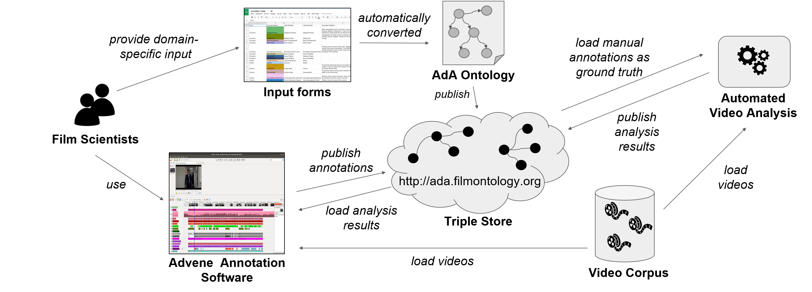

## About the Project

*Image Credit: Daniel Vorndran, wikimedia commons, CC-BY-SA 4.0*

### Introduction

The study of audio-visual rhetorics of affect scientifically analyzes the influence of auditory and visual staging patterns on the perception of media productions and the conveyed emotions. The AdA project aims to examine the hypothesis of television reports drawing on audio-visual patterns in cinematographic productions to emotionally affect viewers by analyzing television reports, documentaries and genre films of the topos "financial crisis". In a large-scale corpus analysis, film scholars identify and annotate low- to high-level audio-visual patterns, such as shot duration, dominant colors, major-minor tonality and depicted visual concepts. By comparing different annotations from different scenes and genres, film scholars can analyze this opinion-forming level of reporting.

### Goals

The part of the project that is being worked on at the HPI has two main objectives: 1) creation of a standardized annotation vocabulary to be applied for semantic annotations and 2) semi-automatic classification of audio-visual patterns by training models on manually assembled ground truth annotation data. The annotation vocabulary for empirical film studies and semantic annotations of audio-visual material based on Linked Open Data principles enables the publication, reuse, retrieval, and visualization of results from film-analytical methods. Furthermore, automatic analysis of video streams allows to speed up the process of extracting audio-visual patterns.

### Technical Project Setup

The project relies on tool-based video annotation and data management following the Linked Open Data principles. [Advene](https://www.advene.org/) was chosen for this project as annotation software because it meets best the needs of film scientists: It offers a timeline view and segment based annotations of video sequences using multiple tracks which can be used to annotate various aspects under which a video is analyzed. We closely worked together with the author of Advene who developed project-specific extensions, such as the import of OWL ontologies and export of RDF data, thus enabling film scholars to create semantic video annotations without having to deal with the technical challenges. 

To build a standardized annotation vocabulary from these methods, we have created spreadsheet-based forms that allow film scientists to provide domain-specific concepts, terms, and descriptions using a familiar software environment. We have developed an automated process to generate the project ontology and semantic metadata of the video corpus directly from the input data using the RDF mapping language and RML tools4. The ontology is imported into Advene and exposes the domain-specific vocabulary with unique URIs as annotation tracks in a timeline view so that semantic annotations conforming to the ontology can be exported. Annotations, metadata, and the ontology is published via the project's triple store.

