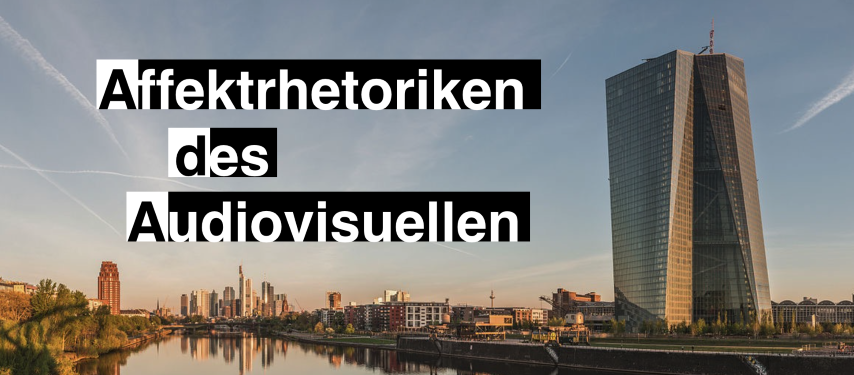

## About the Project

*Image Credit: Daniel Vorndran, wikimedia commons, CC-BY-SA 4.0*

### Introduction

The study of audio-visual rhetorics of affect scientifically analyzes the influence of auditory and visual staging patterns on the perception of media productions and the conveyed emotions. The AdA project aims to examine the hypothesis of television reports drawing on audio-visual patterns in cinematographic productions to emotionally affect viewers by analyzing television reports, documentaries and genre films of the topos "financial crisis". In a large-scale corpus analysis, film scholars identify and annotate low- to high-level audio-visual patterns, such as shot duration, dominant colors, major-minor tonality and depicted visual concepts. By comparing different annotations from different scenes and genres, film scholars can analyze this opinion-forming level of reporting.

### Goals

The part of the project that is being worked on at the HPI has two main objectives: 1) creation of a standardized annotation vocabulary to be applied for semantic annotations and 2) semi-automatic classification of audio-visual patterns by training models on manually assembled ground truth annotation data. The annotation vocabulary for empirical film studies and semantic annotations of audio-visual material based on Linked Open Data principles enables the publication, reuse, retrieval, and visualization of results from film-analytical methods. Furthermore, automatic analysis of video streams allows to speed up the process of extracting audio-visual patterns.

### Test

	 Test indent

Segmentation

	 

	 
Expressive Movement

ExpressiveMovement: Expressive Movement' [Ger. Ausdrucksbewegung] refers to a phenomenological concept (see Plessner: Die Deutung des mimischen Ausdrucks, 1982, Bühler: Ausdruckstheorie, 1933, Wundt: Völkerpsychologie, 1900–1920) that was adapted to describe the affective dynamics of audiovisual images (Kappelhoff/Bakels: Zuschauergefühl, 2011). In this regard films are understood as movement patterns that combine different staging tools such as sound composition, montage rhythm, camera movements, and acting into one temporal gestalt. These patterns organize the spectators' perception processes over the temporal course of film viewing (see Müller/Kappelhoff: Cinematic Metaphor, 2018, 132). This annotation type provides free descriptions of these cinematic expressive movements.

Scene

Structural segmentation unit in the viewer perception that is constituted by aesthetic and narrative markers: for example, through plot and figure constellations (beyond a simple unity of plot, place, and time) for the feature film, as well as through argumentative and other units of meaning for non-fictional formats. The marked scenes are provided with a working title and numbered consecutively.

