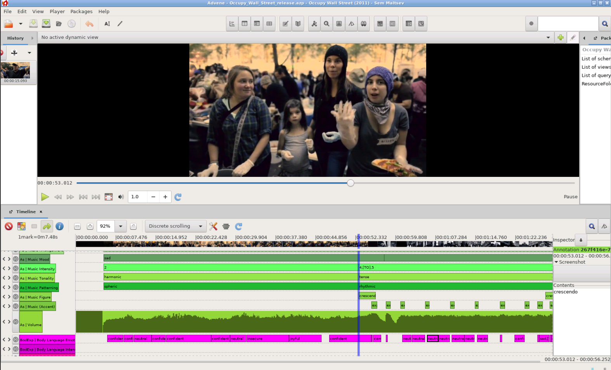

## Film-Analytical Annotations

Throughout the project, the FU Berlin project team created a very high quality data set of manual film-analytical annotations for a set of feature films, documentaries, and television news. These valuable annotations are published here as Linked Open Data under the CC BY-SA 3.0 license to make the data available to other film scientists as well as researchers from other domains.

### Annotation Creation

The annotations were created based on a film scholar's analytical framework ([eMAEX method](https://www.ada.cinepoetics.fu-berlin.de/en/Methoden/eMAEX/index.html)) to study the aesthetics of audio-visual images. The annotation work followed a strict annotation routine to precisely describe the films of the [corpus](../corpus) under different levels of description (see [ontology](../ontology)).

The annotation process is carried out with [Advene](https://www.advene.org/), a free software toolkit for annotating audio-visual documents. We worked closely with Olivier Aubert, the author of Advene, on the one hand to improve the user interface for faster annotation work, and on the other hand to enable the import of the AdA ontology and the export of W3C compliant video annotations as RDF data.

To create annotations that conform to the AdA ontology, you can use the Advene template package that we provide in our [GitHub repository](https://github.com/ProjectAdA/public/tree/master/advene_template).

### Structure

Advene Template

timecode based

semantic video annotations