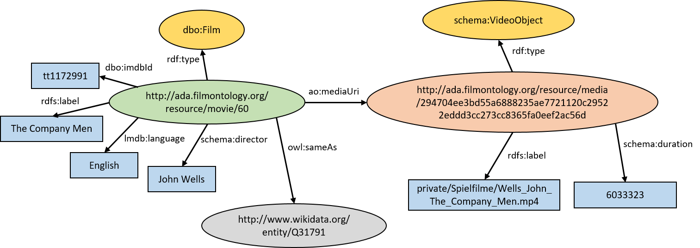

## Corpus Metadata

The FU Berlin project team compiled a video corpus with feature films, documentaries, television news and web videos on the global financial crisis after 2007 in order to investigate audio-visual rhetorics of affect. Since the films cannot be published for copyright reasons, we offer the semantic metadata of the corpus here.

### Structure and Content

The corpus metadata is divided into general film metadata and metadata for video files. Film metadata contains information such as the identifier, title, director and summary of the film. The file metadata contains the exact runtime, the file name and an identifier that was determined by the SHA256 checksum of the file. 

For example, the metadata for the feature film "The Company Men" is defined as follows:

| Identifer | 60 |
| Title | The Company Men |
| Year | 2010 |
| Language | English |
| Writer | John Wells |
| Director | John Wells |
| Runtime | 104 min |
| Abstract | The story centers on a year in the life of three men trying to survive a round of corporate downsizing at a major company - and how that affects them, their families, and their communities. |
| Actors | Ben Affleck, Tommy Lee Jones, Chris Cooper, Suzanne Rico |
| IMDB | http://www.imdb.com/title/tt1172991 |
| Release&nbsp;date | 11.02.2011 |
| Genre | Feature Film |

The file metadata for the feature film "The Company Men" is defined as follows:

| Identifer | 294704ee3bd55a6888235ae7721120c29522eddd3cc273cc8365fa0eef2ac56d |
| Filename | Wells_John_The_Company_Men.mp4 |
| Duration | 6033323 |

### Encoding

The corpus metadata is encoded as RDF data using existing vocabularies such as the [DBpedia Ontology](https://wiki.dbpedia.org/services-resources/ontology), [Schema.org](https://schema.org/), and the [Linked Movie DataBase](http://linkedmdb.org/). Where applicable our resources were linked to Wikidata and DBpedia entities.

### Online Access

### Download

