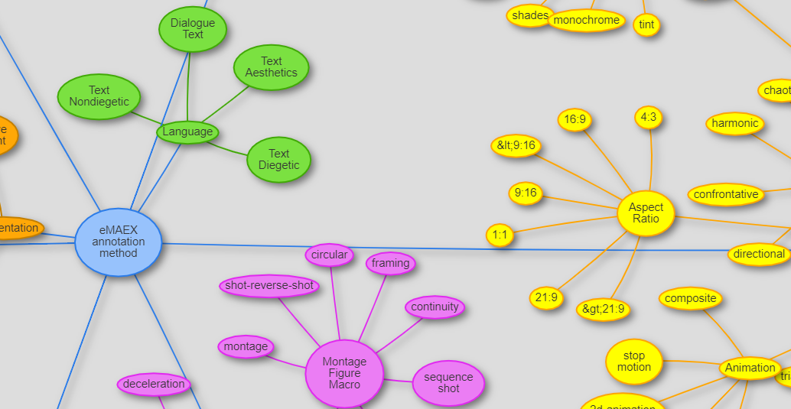

## The AdA Ontology

The AdA ontology is a systematic vocabulary and data model of film-analytical terms and concepts for fine-grained semantic video annotations.

### Purpose

The vocabulary is developed in close collaboration between film scholars and computer scientists to support digital film studies. Its goal is to provide a standardized and systematic way for the joint annotation of audio-visual corpora to enable comparable, systematic film analyzes. The vocabulary is grounded in a methodological film-analytical consensus and is made available as a machine-readable OWL ontology in order to be able to publish annotations as Linked Open Data for the exchange and comparison of analysis data.

### Structure

The AdA ontology is structured into three different kinds of film-analytical concepts:

| | |
|-|-|
| Annotation Levels | General categories of description (e.g., acoustics, camera) |
| Annotation Types | Concepts of film analysis under which a movie is analyzed (e.g., music mood, camera movement speed) |
| Annotation Values | A set of predefined values assigned to each annotation type (e.g., neutral, tense, happy, sad, aggressive for music mood) |

- Annotation Levels: General categories of description (e.g., acoustics, camera)
- Annotation Types: Concepts of film analysis under which a movie is analyzed (e.g., music mood, camera movement speed)
- Annotation Values: A set of predefined values assigned to each annotation type (e.g., neutral, tense, happy, sad, aggressive for music mood)

